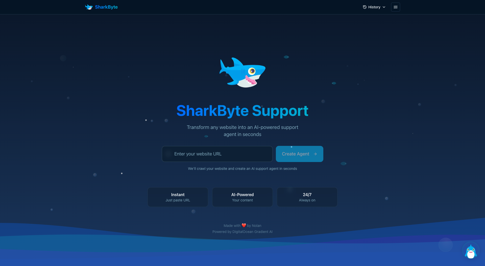
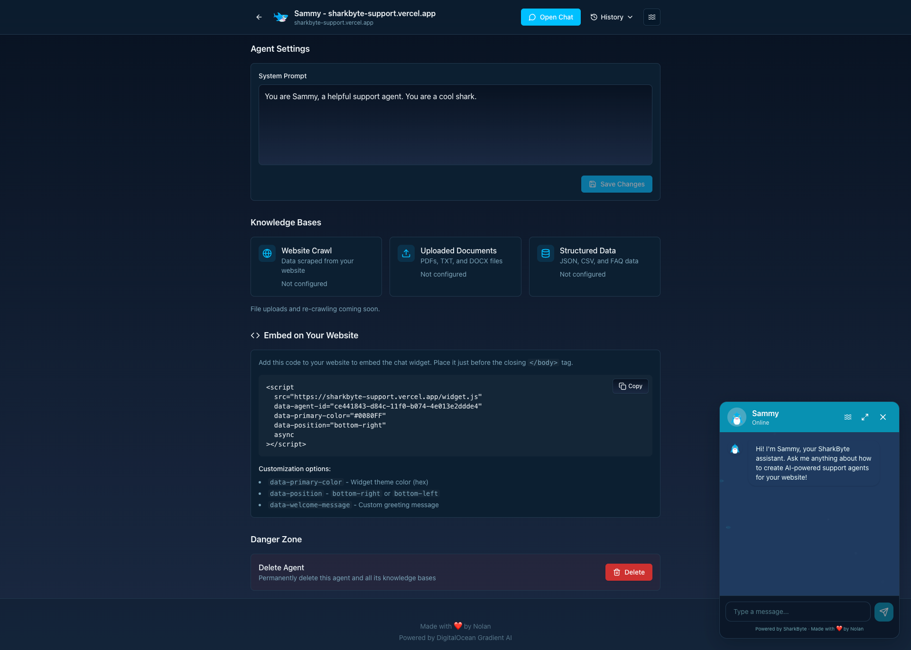
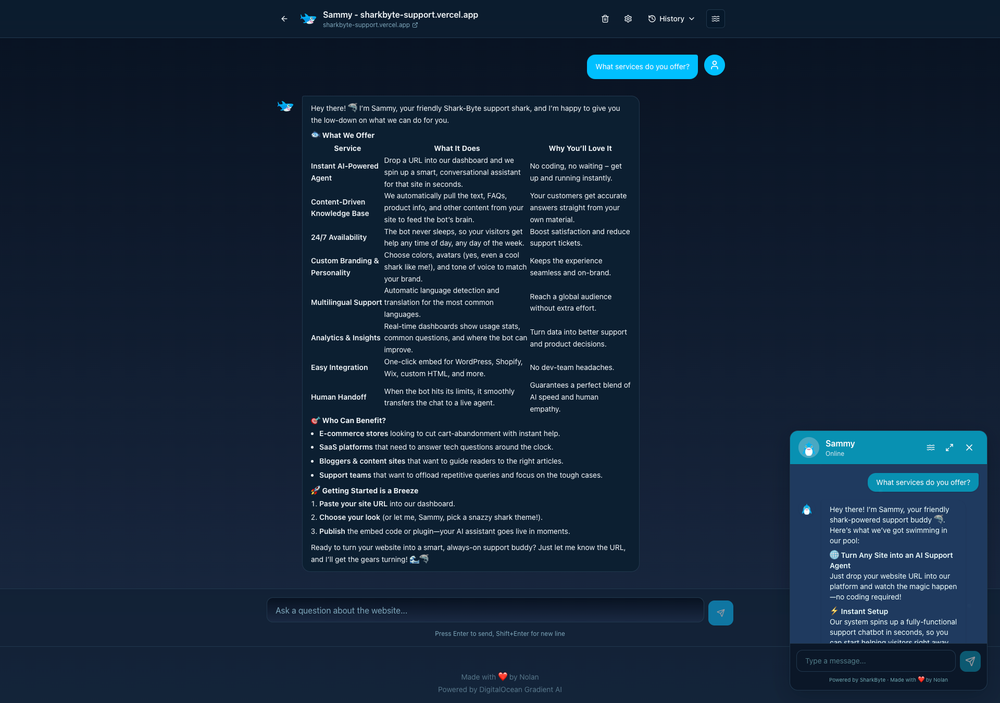
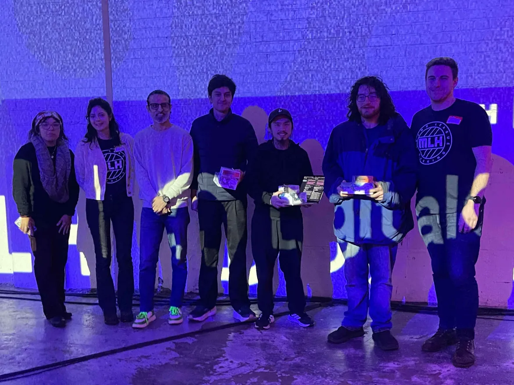
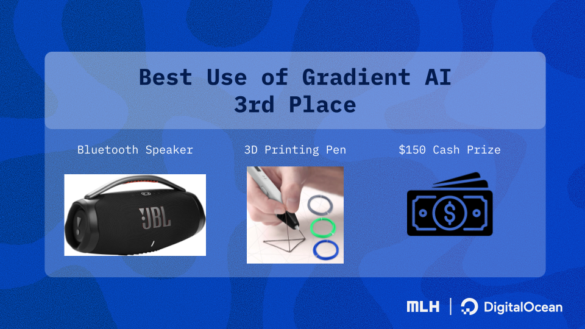

<h1 align="center">SharkByte Support</h1>

<p align="center">
  
</p>

<p align="center">
  <a href="https://devpost.com/software/sharkbyte-support">
    
  </a>
</p>

<p align="center">
  <strong>Smart support in every byte.</strong><br/>
  Transform any website into an AI-powered customer support agent in seconds.
</p>

---

## What is SharkByte?

SharkByte instantly creates an AI chatbot that can answer questions about any website. Just paste a URL, and we handle the rest - no FAQ writing, no training, no complex setup.

**How it works:**
1. Enter a website URL
2. We crawl and analyze the content
3. Your AI support agent is ready to chat

---

## Features

- **Instant Setup** - No configuration required
- **Website-Aware** - Answers based on actual site content
- **Streaming Responses** - Real-time chat experience
- **Theme Options** - Light, Dark, and Ocean modes
- **Mobile Friendly** - Works on all devices

---

## Screenshots

<p align="center">
  
</p>
<p align="center"><em>Homepage - Enter any URL to create an AI support agent</em></p>

<p align="center">
  
</p>
<p align="center"><em>Agent configuration with embed code</em></p>

<p align="center">
  
</p>
<p align="center"><em>AI chat powered by DigitalOcean Gradient</em></p>

---

## Tech Stack

- **Framework**: Next.js 16 (App Router + Turbopack)
- **UI Library**: React 19.2
- **Styling**: Tailwind CSS v4 + shadcn/ui
- **AI**: DigitalOcean Gradient AI
- **Deployment**: Vercel

---

## Getting Started

### Prerequisites

- Node.js 18+
- npm or yarn
- DigitalOcean account with Gradient AI enabled

### Installation

```bash
# Clone the repository
git clone https://github.com/iamnolanhu/sharkbyte-support.git
cd sharkbyte-support

# Install dependencies
npm install

# Set up environment variables
cp .env.example .env.local
# Edit .env.local with your DigitalOcean API token

# Run development server
npm run dev
```

### Environment Variables

Create a `.env.local` file:

```env
# Required
DO_API_TOKEN=your_digitalocean_api_token      # https://cloud.digitalocean.com/account/api/tokens
FIRECRAWL_API_KEY=your_firecrawl_api_key      # https://firecrawl.dev
DO_PROJECT_ID=your_project_id                  # Your DigitalOcean project UUID

# DigitalOcean Gradient AI
DO_REGION=tor1                                 # Only tor1 supports gen-ai agents
DO_EMBEDDING_MODEL_UUID=22653204-79ed-11ef-bf8f-4e013e2ddde4  # gte-large (default)
DO_LLM_MODEL_UUID=18bc9b8f-73c5-11f0-b074-4e013e2ddde4        # GPT-oss-120b (default)

# Optional - Reuse existing database
DO_DATABASE_ID=your_database_id

# Optional - Demo chat widget on landing page
NEXT_PUBLIC_DEMO_AGENT_ENDPOINT=https://your-demo-agent.agents.do-ai.run
NEXT_PUBLIC_DEMO_AGENT_ACCESS_KEY=your_demo_access_key
```

---

## Usage

1. Open [http://localhost:3000](http://localhost:3000)
2. Enter a website URL
3. Wait for the agent to be created
4. Start chatting!

---

## Deployment

Deploy to Vercel with one click:

[](https://vercel.com/new/clone?repository-url=https://github.com/iamnolanhu/sharkbyte-support)

Or deploy manually:

```bash
npm run build
vercel deploy --prod
```

---

## Project Structure

```
sharkbyte-support/
├── public/
│   ├── images/       # Screenshots & hackathon photos
│   ├── sammy/        # Sammy mascot assets
│   └── widget.js     # Embeddable chat widget
├── scripts/          # Dev utilities (cleanup, create-agent)
├── src/
│   ├── app/          # Next.js pages & API routes
│   ├── components/   # React components
│   ├── lib/          # DigitalOcean client, config, utils
│   ├── styles/       # Theme system
│   └── types/        # TypeScript interfaces
└── [config files]    # package.json, tsconfig, etc.
```

---

## Team

<p align="center">
  
  &nbsp;&nbsp;&nbsp;
  
</p>

<p align="center"><strong>The Sharks</strong> 🦈 - <strong>3rd Place</strong> at MLH x DigitalOcean Hackathon 2025</p>

<p align="center">
  <a href="https://devpost.com/software/sharkbyte-support">View on Devpost</a> | <a href="https://sharkbyte-support.vercel.app/">Live Demo</a>
</p>

---

## Built With

- [DigitalOcean Gradient AI](https://docs.digitalocean.com/products/gradient-ai-platform/)
- [Next.js](https://nextjs.org/)
- [Tailwind CSS](https://tailwindcss.com/)
- [shadcn/ui](https://ui.shadcn.com/)
- [Vercel AI SDK](https://sdk.vercel.ai/)

---

## License

**Dual License** - Free for non-commercial and open source use. Commercial use requires a paid license. See [LICENSE](LICENSE) for details.
